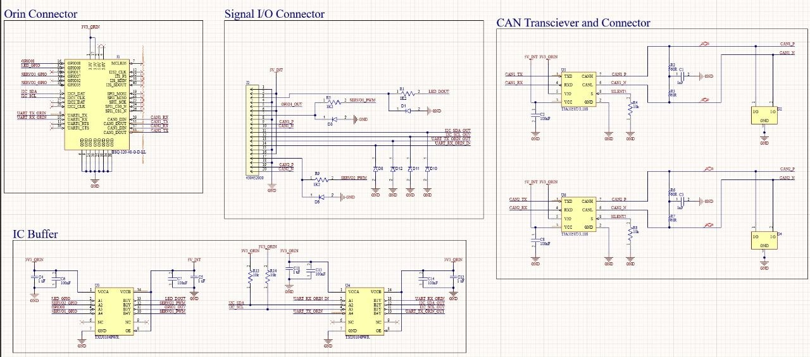
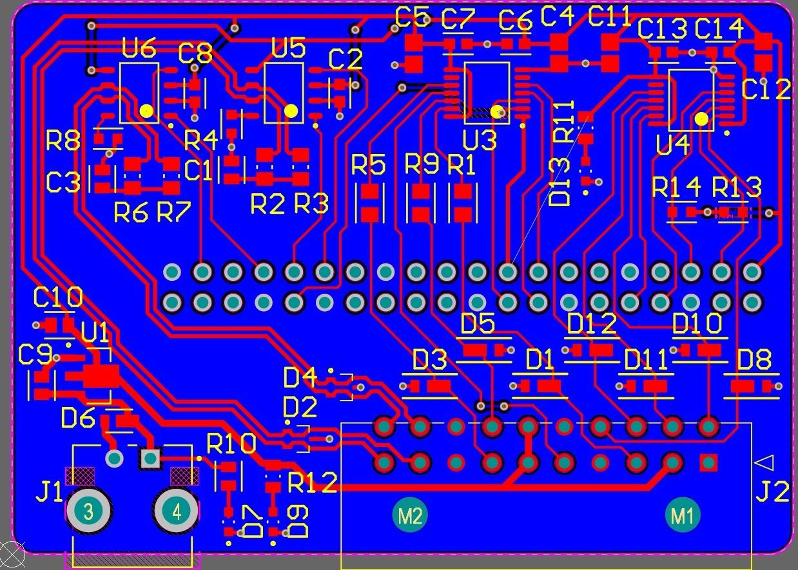
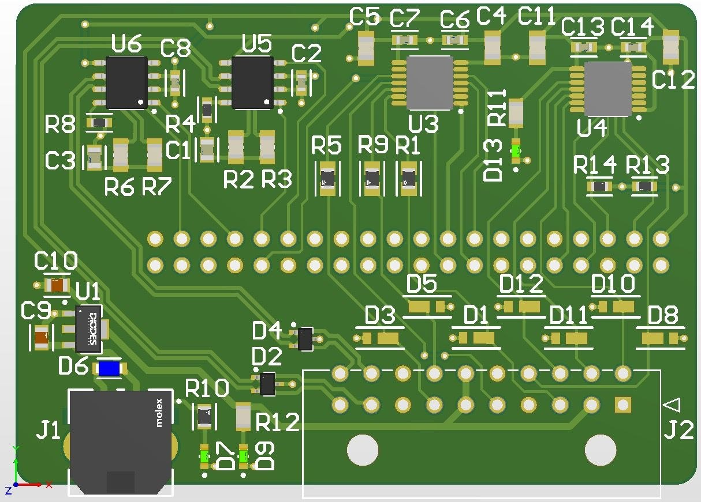

# Orin HAT Breakout Board

## Overview
The **Orin HAT** is a breakout board / HAT designed for the **NVIDIA Jetson AGX Orin**, providing smooth and organized pin connections for prototyping, development, and CAN bus tracing. This board simplifies access to GPIOs, communication buses, and power while ensuring robust protection for both the Jetson and connected peripherals.  

All signal lines on the HAT include **diodes for reverse current protection**, preventing accidental damage from reversed connections or miswiring.  

The 3.3V rail is supplied directly by the Orin, while the 5V rail is generated by stepping down an external 12V input through a dedicated regulator.  

This PCB was designed using **Altium Designer** and was developed for **SC Robotics as a sub-project for the Mars Rover** with the assistance of [Tyler Le](https://www.linkedin.com/in/tyler-le-a98a46218/) and [Cory Hague](https://www.linkedin.com/in/cory-hague-10a737aa/).

---

## Features
- Breakout / HAT for **NVIDIA Jetson AGX Orin**  
- Dual voltage setup:  
  - 3.3V from Orin  
  - 5V generated from 12V input via step-down regulator  
- IC buffers for clean, stable pin signals  
- **Every signal connection is protected by a diode** to prevent reverse current  
- CAN communication tracing support  
- Organized breakout pins for GPIO, power, and communication lines  
- Developed for **SC Robotics Mars Rover sub-project**  

---

## Components
- **Voltage regulator:** 12V → 5V for external devices  
- **IC buffers:** Protect Jetson pins and drive multiple outputs  
- **Diodes:** Reverse current protection on all signal lines  
- **Connectors:** Compatible with Jetson AGX Orin header  
- **Decoupling capacitors:** Stabilize voltage rails  
- **Breakout pins:** All Jetson GPIOs, power, and communication lines accessible  

---

## Wiring & Connections
| Connector / Pin | Function |
|-----------------|---------|
| 12V Input | Primary power supply for 5V regulator |
| 5V Output | Generated from 12V input via step-down regulator |
| 3.3V Output | Supplied directly by the Orin |
| GPIO / Signal Lines | Buffered outputs connected to Jetson pins **through diodes for reverse current protection** |
| CAN_H / CAN_L | Traced and protected CAN communication lines |
| Ground (GND) | Common ground for Jetson and peripherals |

> **Note:** Every signal line passes through a diode, so reverse current from peripherals or miswiring is blocked. Always verify the 12V input is within tolerance.

---

## Usage
1. Mount the Orin HAT on the **NVIDIA Jetson AGX Orin** header.  
2. Connect a stable 12V power supply to the input (for the 5V rail).  
3. Connect peripherals or test circuits to the breakout pins. All signal lines are protected by diodes.  
4. Use the buffered GPIOs for clean signal driving and measurement.  
5. For CAN bus tracing, connect the CAN_H and CAN_L lines; the HAT protects the Jetson pins and allows reliable monitoring.  
6. Verify voltages at 5V output for any external devices; 3.3V is supplied directly by the Orin.  

---

## Applications
- Prototyping with **Jetson AGX Orin** GPIOs  
- CAN bus development and debugging  
- Sensor integration and robotics projects  
- Educational and research projects with Jetson platforms  
- Developed for **SC Robotics Mars Rover sub-project**  

---

## Images

### Schematic
  
> **Note:** The second schematic page showing the 5V regulator and LED drive circuits is not included here, as it is secondary to the main breakout connections.

### PCB Layout

### 3D PCB Render
